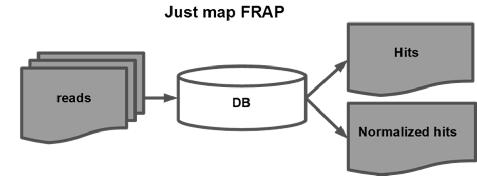
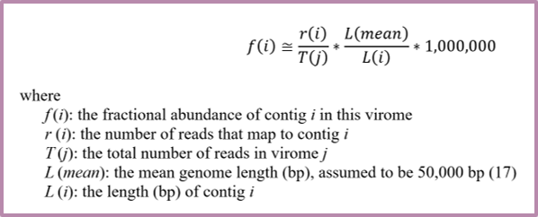
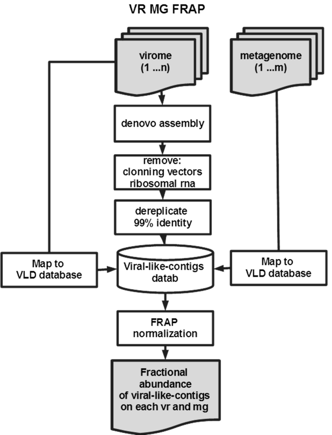

# FRAP

Fragment Recruitment Assembly Purification 

Quick and simple bioinformatics!

### What is FRAP? ###

FRAP is a robust and simple algorithm to compare a genomic dataset to a database

By using the same method across databases and datasets the comparissons are eassier 

### Usage ###

Use:

jmf4.pl [path to database fasta file] [path to the directory containing the datasets] [path to results folder] [mapper to use: smalt or hisat] [average genome length to use, recommended 50000 for phages]

Example: 

perl jmf4.pl /home/acobian/mt/DB/CDS_Pseudomonas_aeruginosa_WCHPA075019.fasta /home/acobian/mt/DS /home/acobian/mt/OUT smalt 5000000

### I/O ### 
Input 
Database: fasta file containing the sequences to compare
Dataset: fasta file with query sequences

Output
Table with normalized hits 
Table with normailzed hits multiplied by a million 
Table with number of hits

Optional outputs
fasta file with reads that map to the refenrence database
fasta file with reads that do not map to the reference database

### Dependencies ###

FRAP require a set of tools, most of these tools are installed using the setup.sh script if they are already not in your path.
  
### Installing <this software> from Github

1. `git clone https://github.com/yinacobian/frap/`
2. `bash setup.sh -I`
  
The following tools are downloaded and installed by setup.sh file if not already installed and in your path
* **SMALT** http://www.sanger.ac.uk/science/tools/smalt-0
* **hisat2** https://ccb.jhu.edu/software/hisat2/index.shtml
* **diamond** https://github.com/bbuchfink/diamond

### Installing <this software> dependencies manually
  
* **SMALT** 

Download smalt: wget http://sourceforge.net/projects/smalt/files/smalt-0.7.6-static.tar.gz

tar zxvf smalt-0.7.6-static.tar.gz

cd smalt-0.7.6

./configure

make

make install

If you don't have permissions in /usr/local/bin redirect them to a new directory, for example: 

./configure --prefix=/somewhere/else/than/usr/local 

then add the path to your .bashrc file, to do so:
    
    1. Go to your home folder
    2. open the file in nano: nano .bashrc
    3. Add the path to the .bashrc file 
          PATH=$PATH:/path/bin/smalt
    4. Reload the .bashrc file
          source ~/.bashrc

### Metagenomes to viromes ###

### FRAP Graphical outputs ###

This is included in jmf5.pl 

Heatmap

Coverage plots for top 5 elements in the database with highest average FRAP values across the dataset 

Fragment recruitment plots for top 5 elements in the database with highest average FRAP values across the dataset

### Dependencies for graphics outputs ###

* **samtools** Version 1.6 or higher http://www.htslib.org/doc/samtools-1.6.html
* **R**	with libraries gplots RColorBrewer

### FRAP vs bacteria representative genomes ###

Smalt is not very good at creating indexes for large databases, for example all bacteria representative genomes (23Gb). To overcome this limitation you can split the databse into several fragments, run FRAP on each database fragments and then concatenate your results. Here is an example of how to do it: 

### About your database ###

Make sure that your database headers are unique, otherwise the counts would be wrong.
You can rename your database headers to consecutive numbers with this command:

awk '/^>/{print ">simbiodiniumA" ++i; next}{print}' < db_names.fasta > db_names_consecutive.fasta

Also check that your database has no special characters on the names or IDS, for example having a # in the middle of a name would ruin the database. 

For example: 

`grep -n '#' all_viral_genomic.fna`

363326:>NC_025401.1 Sunguru virus isolate Ug#41, complete genome

1398717:>NC_030888.1 Sclerotium hydrophilum virus 1 isolate ShR#20 putative RNA-dependent RNA polymerase gene, complete cds

1398745:>NC_030891.1 Sclerotium hydrophilum virus 1 isolate ShR#77 hypothetical protein genes, complete cds

1989177:>NC_033780.2 Mythimna unipuncta granulovirus isolate MyunGV#8, complete genome

